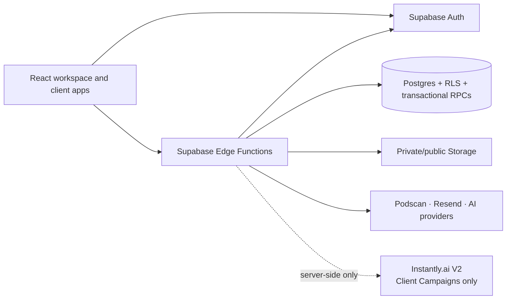

# Get On A Pod

Get On A Pod is a multi-workspace podcast placement platform for agencies, consultants, and their clients. It combines client onboarding, recurring podcast discovery, shortlist approvals, outreach operations, client portals, and white-label presentation in one application.

This README is the engineering and product entry point. Detailed security contracts and runbooks live in [`docs/`](docs/).

## Product at a glance

The product has three distinct audiences:

| Audience | Experience | Primary routes |
| --- | --- | --- |
| Platform owner | Operates My Workspace and can open any active agency workspace without impersonating its owner | `/app/*`, `/app/workspaces/:workspaceId/*` |
| Workspace team | Runs one agency or consultancy and manages its clients | `/app/*` |
| Agency client | Reviews podcast opportunities and uses a client-specific portal | `/client/:slug`, `/portal/*` |

The current product is invite-only:

- Public workspace registration is disabled.
- A private workspace has one owner plus optional admins and members.
- Workspace users and client portal users are separate identities.
- Billing and self-serve checkout are not part of the workspace release.
- The platform owner stays signed in as the platform owner while managing a selected workspace; there is no owner impersonation.

## Core workflows

### 1. Onboard a client

An owner or admin creates a workspace client, starts an onboarding invitation, and shares an expiring capability link. The client can save progress and submit without creating a portal account. The agency reviews the answers, requests revisions, and explicitly approves the generated pitch profile.

### 2. Run weekly podcast discovery

Podcast Finder is a workspace-level tool with a selectable active client. It combines the client's research profile with Podscan discovery, excludes podcasts already associated with that client, and keeps weekly discovery focused on new opportunities. Results can be sorted and reviewed before they enter the client's shortlist.

### 3. Manage the client shortlist

Each client command center includes an approval-dashboard editor. The agency can curate, feature, reorder, and remove opportunities without returning to Podcast Finder. A dashboard can remain private or be made live through its shareable client URL.

### 4. Run outreach

Client Campaigns gives each active client one ongoing podcast-outreach campaign, with new opportunities added in weekly waves. Operators review an individual pitch before launch, then start, pause, resume, and manually synchronize the corresponding standard Instantly campaign. The workspace owner connects one Instantly V2 API key; authorized workspace managers can run campaigns without seeing the credential. Master Inbox and Mailboxes remain separate future integrations.

### 5. Deliver a white-label client experience

Workspace branding controls the agency name, logo, primary color, and accent color shown on shared client experiences. Client-specific display names and presentation settings can further tailor an approval dashboard without exposing internal workspace details or infrastructure.

## Workspace modules

“Available” means a module has a workspace route and a workspace-aware product surface. It does not imply that every planned provider integration is connected.

| Module | Repository status | Purpose |
| --- | --- | --- |
| Overview | Available | Workspace launchpad and module map |
| Onboarding | Available | Forms, invitations, autosave, review, revisions, files, and pitch approval |
| Podcast Finder | Available | Client-selectable recurring discovery with history deduplication |
| Clients | Available | Client records and command centers |
| Client Campaigns | Available with Instantly V2 | Encrypted workspace connection, campaign index, weekly pitch queue, per-podcast launch, activity, analytics sync, and settings |
| Master Inbox | Layout preview | Future cross-campaign reply queue with client and thread context |
| Mailboxes | Layout preview | Future sending-account health, capacity, and assignment surface |
| Guest Resources | Available | Workspace-authored resources for all clients or selected clients |
| Settings | Available to owners/admins | Team access, credentials, branding, agency name, and sidebar order |
| Prospect Dashboards | Planned workspace migration | Prospect lead-magnet dashboards |
| Podcast Database | Planned workspace migration | Read-only shared-catalog browsing before any tenant write support |
| Client Podcast System | Planned workspace migration | Recording, scheduled, and going-live operations |

Planned modules remain disabled in the workspace navigation until their complete tenant boundary is implemented. A visible legacy admin page is not automatically safe for workspace users.

## Instantly outreach suite

The outreach experience is intentionally split by job-to-be-done:

### Client Campaigns

The campaign experience is organized around one ongoing podcast-booking campaign per client:

- an operational index surfaces campaign status, the current weekly wave, pitch readiness, contacted podcasts, bookings, and the next action;
- a two-step creation flow chooses the client, active sending accounts, and first wave while saving the draft in GOAP;
- client-positive podcasts are selected automatically, while an owner can deliberately include another shortlisted show;
- the campaign workspace groups podcasts by weekly wave and supports focused pitch-queue views;
- selecting a podcast opens a right-side workspace where managers confirm or correct the campaign-local host contact, review fit context and suggested angles, and write the individual pitch;
- saving a draft does not contact anyone; the explicit **Approve & start outreach** action creates or recovers the mapped provider campaign, adds that podcast contact, and activates sending;
- activity and performance use sanitized workspace-scoped campaign and lead data returned by Instantly; and
- settings update the campaign name, IANA timezone, daily limit, and active sending accounts.

GOAP creates a standard three-email Instantly sequence and stops on reply. Workspace groups and subsequences are intentionally not used. A podcast host may be contacted for different GOAP clients, so provider duplicate-skipping is disabled while local client/campaign ownership remains exact.

The same campaign surfaces are available in My Workspace and in a platform-owner-selected workspace. Client command centers link directly to their campaign.

### Master Inbox

The inbox should unify replies without flattening their context. Each conversation should retain:

- workspace, client, Instantly campaign, and lead identity;
- the original outbound message and complete thread;
- unread, interested, needs-response, snoozed, and closed workflow states;
- provider event identifiers for idempotency; and
- an auditable record of drafts and sends.

### Mailboxes

The infrastructure view should expose:

- sending address and provider status;
- warmup status and health signals;
- daily limit, current use, and remaining capacity;
- campaign and client assignments; and
- last successful provider synchronization.

### Implemented Client Campaigns boundary

Instantly credentials are never returned to the browser after the owner submits the connection form. The authenticated `workspace-client-campaigns` Edge Function verifies the key, encrypts it with AES-GCM, and stores only ciphertext, IV, and a four-character hint in a service-role-only table. The browser receives sanitized integration metadata, account summaries, campaign analytics, and target state—never the stored credential.

The campaign boundary also enforces:

1. one Instantly workspace connection per GOAP workspace, with an Instantly workspace prevented from being attached to multiple tenants;
2. one local campaign per exact same-workspace client and one provider campaign mapping per local campaign;
3. owner-only credential connection and removal, with campaign actions restricted to owner, admin, or platform-owner workspace access;
4. deterministic provider campaign naming and recoverable launch states to prevent duplicate campaigns after retries or timeouts;
5. per-target launch states, podcast uniqueness, provider lead IDs, and same-campaign contact checks so retries recover safely without silently duplicating or overwriting outreach;
6. fixed-origin server-side Instantly requests with timeouts, response-size limits, permission-safe provider errors, and sanitized analytics; and
7. actor-aware audit records for connection, draft, launch, pause, resume, and other material campaign actions.

Client Campaigns currently synchronizes on an explicit operator action; webhook-driven reply ingestion is not part of this release. Master Inbox and Mailboxes remain non-operational previews until their own event-ledger, ownership, and provider-write boundaries are implemented.

Legacy Bison/Clay outreach code remains in the repository for operator history. It is global-provider code and must not be wired into workspace routes without the same ownership, event-ledger, and isolation guarantees.

## Identity and authorization

| Actor | Workspace scope | Staff controls | Client operations | Workspace selector |
| --- | --- | --- | --- | --- |
| Platform owner | My Workspace plus one explicitly selected agency workspace | Owner-equivalent in selected workspace | Full supported-module access | Yes, top-right |
| Workspace owner | One workspace | Admins, members, credentials, ownership transfer | Full | No |
| Workspace admin | One workspace | Members | Manage supported operations | No |
| Workspace member | One workspace | None | Module-specific restricted/read-only access | No |
| Client portal user | One client | None | Published client experience only | No |

Important boundaries:

- Browser-provided workspace, membership, client, and record IDs are untrusted selectors.
- Tenant mutations are authorized again inside versioned `SECURITY DEFINER` database functions.
- Tenant records carry or derive an exact `workspace_id`.
- Cross-workspace child relationships use same-workspace constraints.
- Direct browser writes to protected operational tables remain closed.
- The platform owner's selected-workspace actions preserve the platform actor ID for auditing.
- Client portal sessions cannot authorize workspace routes.
- Suspended or stale identities fail closed.

See [`docs/subagency-saas-architecture.md`](docs/subagency-saas-architecture.md) for the full tenancy model.

## Route map

### Workspace users

| Route | Surface |
| --- | --- |
| `/login` | Workspace sign-in |
| `/accept-invite` | Workspace invitation completion |
| `/change-password` | Required initial-password replacement |
| `/app/overview` | My Workspace overview |
| `/app/onboarding` | Onboarding management |
| `/app/podcast-finder` | Client-selectable podcast discovery |
| `/app/clients` | Clients |
| `/app/clients/:clientId` | Client command center |
| `/app/client-campaigns` | Client campaign operations index |
| `/app/client-campaigns/:clientId` | Weekly pitch queue and campaign workspace |
| `/app/master-inbox` | Future Instantly inbox preview |
| `/app/mailboxes` | Future Instantly mailbox preview |
| `/app/guest-resources` | Workspace guest resources |
| `/app/settings` | Workspace settings, team, branding, and navigation order |

### Platform owner selected-workspace routes

The same modules are reused under:

```text
/app/workspaces/:workspaceId/overview
/app/workspaces/:workspaceId/onboarding
/app/workspaces/:workspaceId/podcast-finder
/app/workspaces/:workspaceId/clients
/app/workspaces/:workspaceId/clients/:clientId
/app/workspaces/:workspaceId/client-campaigns
/app/workspaces/:workspaceId/client-campaigns/:clientId
/app/workspaces/:workspaceId/master-inbox
/app/workspaces/:workspaceId/mailboxes
/app/workspaces/:workspaceId/guest-resources
/app/workspaces/:workspaceId/settings
```

The workspace switcher preserves the current module when possible. Client-bound detail routes return to the target workspace's module-level chooser rather than carrying a client ID across workspaces.

Legacy `/app/outreach-platform`, `/app/unibox`, `/admin/outreach-platform`, and `/admin/leads` entry points redirect to the canonical outreach-suite routes.

### Public and client routes

| Route | Surface |
| --- | --- |
| `/onboarding/:token` | Capability-protected client intake |
| `/client/:slug` | Shareable podcast approval dashboard |
| `/prospect/:slug` | Prospect lead-magnet dashboard |
| `/portal/login` | Client portal sign-in |
| `/portal/dashboard` | Protected client portal overview |
| `/portal/resources` | Protected client resources |

## System architecture



The React application is a Vite SPA. Supabase provides authentication, PostgreSQL, Storage, and Edge Functions. The production container builds static assets and serves them through [`scripts/serve-production.mjs`](scripts/serve-production.mjs), including SPA fallback and security checks.

## Repository layout

```text
src/
  components/             Shared UI and workspace shell
  contexts/               Workspace and client auth contexts
  lib/                    Routing, validation, sanitization, and utilities
  pages/app/              Native workspace pages
  pages/admin/            Platform wrappers and legacy operator pages
  pages/client/           Shareable client approval experience
  pages/onboarding/       Public capability-based intake
  pages/portal/           Protected downstream client portal
  services/               Narrow browser-to-Supabase service layer
supabase/
  migrations/             Ordered schema and authorization changes
  functions/              Edge Functions and shared server code
  tests/                  PostgreSQL behavior/isolation suites
scripts/                  Release, security, staging, and diagnostic tooling
docs/                     Architecture, API references, and operator runbooks
mcp-prospect-dashboard/   MCP server for prospect-dashboard workflows
```

## Local development

### Requirements

- Node.js `22.22.2`
- npm `10.9.7`
- Deno `2.5.2` for Edge Function validation
- A Supabase project or local Supabase stack
- Supabase CLI and PostgreSQL tooling for migration/behavior work

The Node and npm versions are intentionally pinned in [`package.json`](package.json) and the production [`Dockerfile`](Dockerfile).

### Install and run

```bash
npm ci
cp .env.example .env.local
npm run dev
```

The development server binds to `127.0.0.1:8080` by default. Set `DEV_SERVER_HOST` only when an explicitly trusted container or LAN environment requires another bind address.

### Browser-safe environment variables

```dotenv
VITE_SUPABASE_URL=https://your-project.supabase.co
VITE_SUPABASE_ANON_KEY=your-publishable-or-anon-browser-key
VITE_APP_URL=http://localhost:8080
VITE_SENTRY_DSN=
VITE_APP_VERSION=
```

Every `VITE_*` value is embedded into the public browser bundle. Only browser-safe configuration belongs there. The current client reads the Supabase public key through `VITE_SUPABASE_ANON_KEY`, including when the project uses a newer publishable-key value.

### Server-only secrets

Provider credentials belong in Supabase secret storage or the authorized operator environment. Examples include:

- `SUPABASE_SERVICE_ROLE_KEY`
- `SUPABASE_DB_PASSWORD`
- `PODSCAN_API_KEY`
- `ANTHROPIC_API_KEY` or `OPENAI_API_KEY`
- `RESEND_API_KEY`
- `ONBOARDING_CAPABILITY_SECRET`
- Google service-account credentials
- `INSTANTLY_CREDENTIAL_ENCRYPTION_KEY` (at least 32 random characters; server-side encryption key)

Each workspace owner's Instantly V2 API key is entered in Client Campaigns and encrypted before database storage. It is tenant data, not a shared deployment secret, and must never be copied into a `VITE_*` variable.

Never prefix a private credential with `VITE_`, commit it to a dotenv file, paste it into a migration, or expose it in a client error message. Run `npm run check:secrets` before release.

## Common commands

| Command | Purpose |
| --- | --- |
| `npm run dev` | Start Vite locally |
| `npm run build` | Generate the static sitemap and production SPA |
| `npm run typecheck:app` | Type-check the application |
| `npm run lint:mvp` | Lint the supported workspace release surface |
| `npm run test:workspace-mvp` | Run workspace, portal, service, and route tests |
| `npm run test:podcast-research` | Run Podcast Finder and research tests |
| `npm run check:edge` | Cache, type-check, and test all Edge Functions with pinned Deno |
| `npm run check:secrets` | Scan tracked source and release output for credential hazards |
| `npm run check:static` | Run the complete static release gate |
| `npm run test:staging` | Run authorized staging acceptance checks |
| `npm run verify:production-browser` | Verify the deployed public browser bundle |

For a normal workspace UI change, the minimum useful local gate is:

```bash
npm run typecheck:app
npm run lint:mvp
npm run test:workspace-mvp
npm run build
npm run check:secrets
```

`npm run check:static` is the authoritative full gate and has additional toolchain and network requirements.

## Database and Edge Function changes

Frontend deployment does not apply database migrations or deploy Edge Functions.

For any backend increment:

1. Add a forward-only migration under [`supabase/migrations/`](supabase/migrations/).
2. Make the migration idempotent where retry safety requires it, without hiding a partial failure.
3. Keep privileged operations in narrow, versioned SQL functions with explicit grants and a safe `search_path`.
4. Add two-workspace, cross-client, role, stale-token, malformed-ID, and direct-RLS denial coverage.
5. Update or add the matching Edge Function contract test.
6. Run SQL grammar, application typecheck, focused tests, Edge checks, and secret scanning.
7. Apply migrations to an authorized staging environment in filename order.
8. Deploy only the Edge Functions in the release and confirm their `verify_jwt` settings against [`supabase/config.toml`](supabase/config.toml).
9. Run signed-in staging acceptance before production.

Behavior scripts intentionally require explicit targets and confirmation. Do not point them at production casually. Some suites run inside a transaction and end with `ROLLBACK`; read the relevant runbook before execution.

## Deployment

The repository includes a multi-stage production [`Dockerfile`](Dockerfile) and [`railway.toml`](railway.toml).

The container build:

1. installs the pinned Node/npm dependency graph with `npm ci`;
2. validates required browser-safe Supabase configuration;
3. builds the static application;
4. scans the browser bundle for prohibited credentials; and
5. creates a non-root runtime image containing only production dependencies, built assets, and the production server.

The recommended release order is:

1. Confirm the intended Git diff and migration/function manifest.
2. Back up and inventory the target Supabase environment.
3. Apply and verify migrations.
4. Set or rotate server-only secrets.
5. Deploy changed Edge Functions with the reviewed JWT/CORS configuration.
6. Deploy the frontend container.
7. Run authenticated workspace, selected-workspace, client-dashboard, and portal acceptance.
8. Run browser-bundle and retired-asset verification.
9. Record evidence in the appropriate runbook without committing secret values, session tokens, or bearer links.

Historical deployment IDs and commit hashes do not belong in this README because they become stale. Release-specific evidence belongs in a dated document such as [`docs/production-cutover-2026-07-21.md`](docs/production-cutover-2026-07-21.md).

## Troubleshooting

### A Supabase Function returns `400`

Inspect the response body in the browser Network panel. A `400` usually means the deployed function and frontend disagree about request fields, an identifier failed validation, or a prerequisite migration is missing. Confirm the deployed function version before changing the UI around the error.

### A Supabase Function returns `500`

Check the function logs using a sanitized request. Common causes are a missing server secret, unapplied SQL function/migration, provider failure, or an authorization invariant failing inside the transaction. Do not replace a specific server failure with a success-looking client state.

### The browser reports a CORS preflight failure

The `OPTIONS` request must return a successful status with the shared allowed-origin headers before authentication or request-body validation. Confirm the function is deployed, its route name is correct, and the production origin is allowed. A missing function can look like CORS because the platform rejects the preflight before the handler runs.

### A workspace page says “unavailable”

Check that the route contains a canonical UUID, the workspace is active, and it has exactly one available owner. Selected-workspace pages intentionally fail closed if the returned workspace, owner, clients, or route ID do not agree.

### A client dashboard is hidden

Hidden means the dashboard exists but is not shared. Open the client command center, use the Approval dashboard section, and make the dashboard live. The public route remains inaccessible while `dashboard_enabled` is false.

### The production page still shows an older bundle

Confirm the deployment commit, inspect the HTML asset references, purge only the intended CDN cache, and run `npm run verify:production-browser`. Do not assume a successful Git push proves that migrations, functions, the container, and the CDN all changed together.

## Documentation map

- [`docs/subagency-saas-architecture.md`](docs/subagency-saas-architecture.md) — tenancy and authorization model
- [`docs/tenant-feature-parity-mvp.md`](docs/tenant-feature-parity-mvp.md) — tenant module contract and rollout rationale
- [`docs/workspace-onboarding.md`](docs/workspace-onboarding.md) — onboarding lifecycle, capabilities, files, and deployment
- [`docs/manual-workspace-accounts.md`](docs/manual-workspace-accounts.md) — workspace account operations
- [`docs/architecture/CLIENT-DASHBOARD.md`](docs/architecture/CLIENT-DASHBOARD.md) — client dashboard concepts
- [`docs/architecture/PODCAST-FINDER.md`](docs/architecture/PODCAST-FINDER.md) — podcast discovery architecture
- [`docs/api/README.md`](docs/api/README.md) — API documentation index
- [`docs/production-cutover-2026-07-21.md`](docs/production-cutover-2026-07-21.md) — historical sanitized release evidence

Some historical documents describe legacy global admin tools. The current source, migrations, tests, and tenant contracts take precedence when those documents conflict.

## Definition of done

A workspace feature is not complete merely because a page renders. It is complete when:

- the same component works in My Workspace and an explicitly selected workspace;
- tenant data is bound to the exact workspace and client where applicable;
- owner, admin, member, platform-owner, suspended, and stale-session behavior is defined;
- mutations are transactional, idempotent where needed, and audited;
- direct table access and cross-workspace IDs fail closed;
- responsive layout and horizontal overflow are checked on desktop and mobile;
- focused tests, typecheck, lint, production build, and secret scanning pass;
- backend deployment order and acceptance evidence are documented; and
- the UI distinguishes real data from disconnected, loading, empty, and error states.

That standard is especially important for Instantly: provider connectivity is useful only when workspace ownership, reply ingestion, sending safety, and auditability ship with it.
